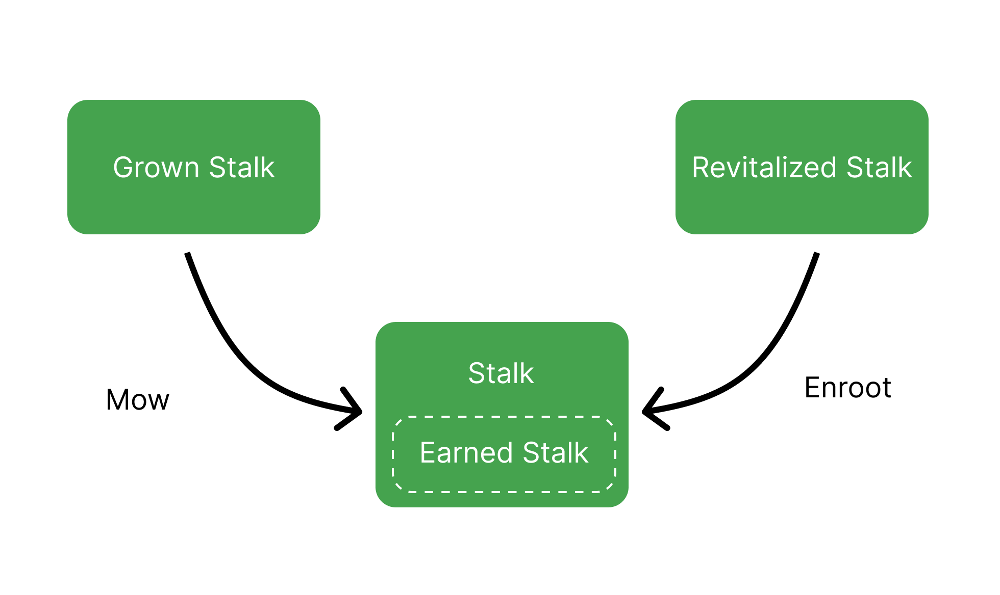

# Asset State Cycles

Check out [Asset States](asset-states.md) page for definitions on each of these asset states.

### Silo

.png>)

### Stalk

### Seeds

.png>)

### Field

.png>)

### Barn

.png>)

