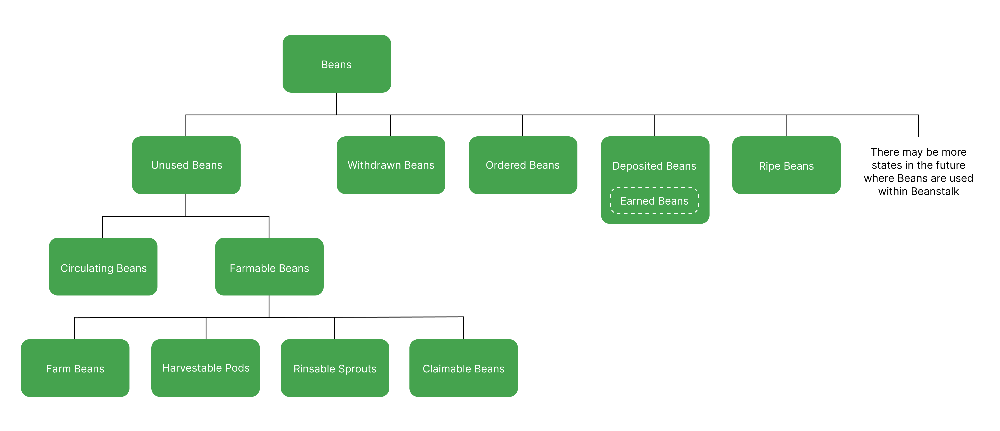

# Asset States

Understanding the various states that Beanstalk assets can be in can help Farmers understand their balances on the Beanstalk UI at Replant.

### Bean states

**Farm Beans**

Beans stored in Beanstalk. Farm Beans can be used in transactions on the Farm.

**Harvestable Pods**

Pods that are redeemable for 1 Bean each. Harvestable Pods must be Harvested in order to use them.

**Rinsable Sprouts**

Sprouts that are redeemable for 1 Bean each. Rinsable Sprouts must be Rinsed in order to use them.

**Claimable Beans**

Withdrawn Beans become Claimable Beans after the end of the current Season. Claimable Beans must be Claimed in order to use them.

**Circulating Beans**

Beans in Farmers’ wallets.

**Farmable Beans**

The superset of Beans stored in Beanstalk that can be used in transactions on the Farm. Includes Farm Beans, Harvestable Pods, Rinsable Sprouts, and Claimable Beans.

**Unused Beans**

The superset of Beans that can be used in transactions on the Farm. Includes Circulating and Farmable Beans.

**Withdrawn Beans**

Beans Withdrawn from the Silo before they are unfrozen. Withdrawn Beans are Frozen until the end of the current Season.

**Ordered Beans**

Beans stored in Pod Orders.

**Deposited Beans**

Beans Deposited in the Silo.

**Earned Beans**

Beans that have been paid to a Silo Member since the last Season the Silo Member Planted their Plantable Seeds. Earned Beans are automatically Deposited into the Silo and do not require any action to claim them.

**Ripe Beans**

Beans that are minted as Fertilizer is sold or Ripe LP is Converted. Unripe Beans represent a pro rata share of underlying Ripe Beans.

### **LP Token states**

LP Tokens can be in the following states, which are identical to the equivalent Bean states described above:

* Farm
* Claimable
* Farmable
* Circulating
* Unused
* Withdrawn
* Deposited
* Ripe

### **Unripe asset states**

Unripe assets can be in the following states, which are identical to the equivalent Bean states described above:

* Farm
* Claimable
* Farmable
* Circulating
* Unused
* Withdrawn
* Deposited

### **Stalk states**

**Earned Stalk** are Stalk earned from Earned Beans. Earned Stalk automatically contribute to Stalk ownership and do not require any action to claim them.

**Grown Stalk** is the Stalk earned from Seeds. Grown Stalk does not contribute to Stalk ownership until it is Mown. Mow can be called on its own, and it is also called at the beginning of any Silo interaction (Depositing, Withdrawing, Converting, etc.).

**Revitalized Stalk** is Stalk that have vested for pre-exploit Silo Members as Fertilizer is sold. Revitalized Stalk do not contribute to Stalk ownership until Enrooted. See the [Barn](../farm/barn.md) section for more info on Revitalized Stalk.

### **Seed states**

**Plantable Seeds** are Seeds earned in conjunction with Earned Beans. Plantable Seeds must be Planted in order to grow Stalk.

**Revitalized Seeds** are Seeds that have vested for pre-exploit Silo Members as Fertilizer is sold. Revitalized Seeds must be Enrooted in order to grow Stalk. See the **** [Barn](../farm/barn.md) section for more info on Revitalized Seeds.
