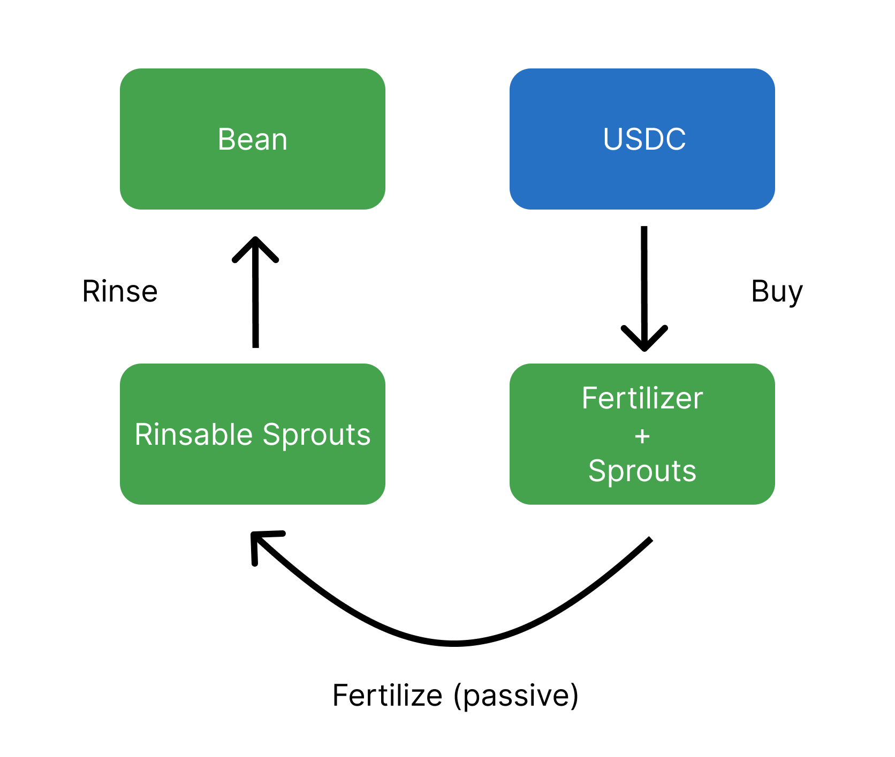

# Barn

On April 17, 2022, Beanstalk was exploited via a governance attack. The attacker used a flash loan to exploit the protocol’s then on-chain governance mechanism and transferred all of the Deposited assets in the Silo to an address they controlled, resulting in a theft of \~$77M in non-Bean assets.

Upon exploit, Beanstalk was Paused and the on-chain governance mechanism was removed. Stalkholders voted [via Snapshot](https://snapshot.org/#/beanstalkfarms.eth/proposal/0xb87854d7f6f40f0877a1333028eab829b213fbcce03f16f9dd3832c8a98ab99b) on how Beanstalk should proceed.

The Barn is the Beanstalk recapitalization facility being used to Replant Beanstalk. The Barn Raise started on June 6, 2022 while the protocol was offline.

### **Fertilizer**

Fertilizer is a semi-fungible limited debt issuance to recapitalize $77M in stolen liquidity.

At the beginning of the Barn Raise, there was 77M Available Fertilizer. Available Fertilizer is the number of Fertilizer that can be bought from Beanstalk in exchange for 1 USDC each. Fertilizer becomes Active when it is bought, at which point the ERC-1155 Fertilizer token is minted.

Active Fertilizer comes with an associated number of Sprouts. Sprouts represent the debt left to be repaid to Active Fertilizer holders. Fertilizer becomes Used after all of its associated Sprouts are Fertilized into Rinsable Sprouts that can be Rinsed (redeemed) for 1 Bean each.

When there are more than zero Unfertilized Sprouts, 1/3 of new Bean mints are allocated towards Fertilizing Sprouts on a parri passu basis. This is in contrast to the FIFO Harvest schedule of the Pod Line in the Field.

Fertilizer is tradeable on [OpenSea](https://opensea.io/collection/bean-fertilizer).

### **Humidity**

The Humidity is the interest rate on Fertilizer purchases. At 200% Humidity, each Fertilizer purchased comes with 3 Sprouts.

The Humidity is constant each [Season](sun.md). The Humidity is 500% prior to the start of the first Season after Replant, after which it drops to 250% and then decreases by an additional 0.5% each Season until it reaches 20%. The Humidity will then remain at 20% until all Available Fertilizer is purchased.

### Barn Process

1. Fertilizer is bought with USDC. Active Fertilizer comes with Sprouts.
2. Sprouts are Fertilized by Fertilizer into Rinsable Sprouts on a parri passu basis when Beanstalk [mints new Beans](../peg-maintenance/overview.md#bean-supply) according to the peg maintenance mechanism.
3. Rinsable Sprouts can be Rinsed to be redeemed for Beans.

### **Unripe Assets**

Beanstalk uses the proceeds from the Fertilizer sales to recapitalize liquidity stolen from Silo Members in the April 17th, 2022 governance exploit. Beanstalk will sell enough Fertilizer to fully recapitalize all non-Bean liquidity stolen from Silo Members.

Upon Replant, Farmers who held Beans in the block prior to the exploit receive 1 Unripe Bean for every pre-exploit Bean; Farmers who held whitelisted LP tokens in the block prior to the exploit receive 1 Unripe BEAN:3CRV LP for every 1 Bean Denominated Value (BDV) of each pre-exploit whitelisted LP token.

Unripe assets are placed on a vesting schedule in accordance with the success of the Barn Raise and growth of the Bean supply thereafter. More specifically, Unripe assets entitle holders to an associated number of underlying Ripe assets that increases as more Fertilizer is sold, and the percentage of Sprouts that are Fertilized increases.

> For example, if 20% of Fertilizer is sold before Replant, a Farmer with 1000 Beans and 2000 BDV of whitelisted LP tokens in the block prior to the exploit will receive 1000 Unripe Beans and 2000 Unripe BEAN:3CRV LP. As Fertilizer is sold and the percentage of Sprouts that are Fertilized increases, Beanstalk mints Ripe BEAN:3CRV LP and Ripe Beans.

### **Chopping**

The percentage of Ripe assets that can be claimed by Chopping a pro rata portion of Unripe assets is a function of the percentage of total Sprouts Fertilized out of all total Sprouts.

Chopped Unripe assets are burned. Beans and BEAN:3CRV LP received for Chopping are distributed from the set of Ripe Beans and Ripe BEAN:3CRV LP, respectively.

> For example, if 1M Sprouts have been Fertilized and there are 10M total Sprouts, then a Farmer who Chops 100 Unripe Beans that correspond to 50 Ripe Beans will get 5 Beans in exchange.

Because Available Fertilizer is a function of how much non-Bean liquidity still needs to be recapitalized, if Available Fertilizer is non-zero and Unripe BEAN:3CRV LP is Chopped, the amount of Available Fertilizer (and thus how much non-Bean liquidity to Beanstalk needs to recapitalize) decreases. The same is true of Conversions from Unripe BEAN:3CRV LP to Unripe Beans in the Silo, while the converse is true of Conversions from Unripe Beans to Unripe BEAN:3CRV LP.

> For example, say there’s 50M Available Fertilizer and a Farmer Chops 2M Unripe BEAN:3CRV LP in exchange for 1M BEAN:3CRV LP. If non-Beans make up 50% of the BEAN:3CRV pool, then 500k less Fertilizer needs to be sold, resulting in 49.5M Available Fertilizer.

### **Revitalized Assets**

Upon Replant, Silo Members in the block prior to the exploit receive a portion of their Stalk and Seeds based on the percentage of Fertilizer sold prior to Replant. As the percentage of Fertilizer sold increases, additional Stalk and Seeds become Revitalized and can be Enrooted. Revitalized Stalk and Seeds start earning Bean seigniorage and Grown Stalk, respectively, upon being Enrooted.

> For example, if 20% of total Fertilizer has sold before Replant, a Silo Member receives 20% of their Stalk, Seed and Plantable Seed balances at the time of the Replant. Once 50% of total Fertilizer has been sold, the additional 30% is in the form of Revitalized Stalk and Seeds. Once Enrooted, a Silo Member brings their balances to 50% of their pre-exploit Stalk and Seed balances, independent of any Stalk or Seeds they may have earned since Replant.
