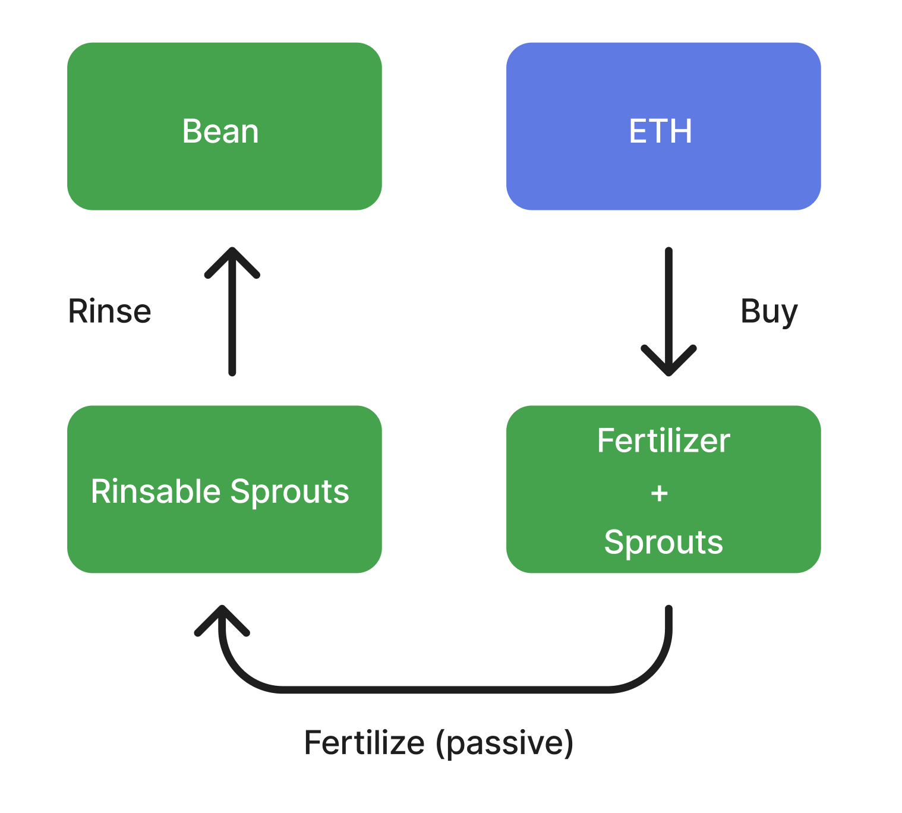

# Barn


Publius explains the Barn


On April 17, 2022, Beanstalk was exploited via a governance attack. The attacker used a flash loan to exploit the protocol’s then on-chain governance mechanism and transferred all of the Deposited assets in the Silo to an address they controlled, resulting in a theft of \~$77M in non-Bean assets.

Upon exploit, Beanstalk was Paused and the on-chain governance mechanism was removed. Stalkholders voted [via Snapshot](https://snapshot.org/#/beanstalkfarms.eth/proposal/0xb87854d7f6f40f0877a1333028eab829b213fbcce03f16f9dd3832c8a98ab99b) on how Beanstalk should proceed.

The Barn is the Beanstalk recapitalization facility used to Replant Beanstalk. The Barn Raise started on June 6, 2022 while the protocol was offline.

For guides on interacting with the Barn through the Beanstalk UI, go [here](../guides/barn/).

#### Timeline

* April 17, 2022: Governance exploit
* June 6, 2022: Barn Raise starts
* August 6, 2022: Beanstalk Replant
* October 20, 2023: Migration of Unripe liquidity from BEAN:3CRV to the BEAN:ETH Well
* July 26, 2024: Migration of Unripe liquidity from BEAN:ETH to BEAN:wstETH

### **Fertilizer**

Fertilizer is a semi-fungible limited debt issuance to recapitalize $77M in stolen liquidity.

At the beginning of the Barn Raise, there was 77M Available Fertilizer. Available Fertilizer is the number of Fertilizer that can be bought from Beanstalk in exchange for 1 USD worth of wstETH each. Fertilizer becomes Active when it is bought, at which point the ERC-1155 Fertilizer token is minted.

Active Fertilizer comes with an associated number of Sprouts. Sprouts represent the debt left to be repaid to Active Fertilizer holders. Fertilizer becomes Used after all of its associated Sprouts are Fertilized into Rinsable Sprouts that can be Rinsed (redeemed) for 1 Bean each.

When there are more than zero Unfertilized Sprouts, 1/3 of new Bean mints are allocated towards Fertilizer on a [pari passu](../protocol/glossary.md#pari-passu) basis. This is in contrast to the FIFO Harvest schedule of the Pod Line in the Field.

* If Fertilizer is not sold yet, it’s Available.
* If Fertilizer still has Sprouts (is owed Bean mints), it’s Active.
* If Fertilizer has no more Sprouts (is done earning Bean mints), it’s Used.

Fertilizer is tradeable on [OpenSea](https://opensea.io/collection/bean-fertilizer).

When Fertilizer is sold, Beanstalk adds liquidity to the BEAN:wstETH Well at a ratio of 1:0.866616. Adding liquidity at this ratio causes the deltaB in the BEAN:wstETH Well to trend towards the pre-exploit deltaB.

### **Humidity**

The Humidity is the interest rate on Fertilizer purchases. At 200% Humidity, each Fertilizer purchased comes with 3 Sprouts.

The Humidity is constant each [Season](sun.md). The Humidity was 500% prior to Replant, after which it dropped to 250% and then decreased by an additional 0.5% each Season until it reached 20%. The Humidity will remain at 20% until all Available Fertilizer is purchased.

### Barn Process

<figure><figcaption></figcaption></figure>

1. Fertilizer is bought with wstETH. Active Fertilizer comes with Sprouts.
2. Sprouts become Rinsable on a pari passu basis when Beanstalk [mints new Beans](../peg-maintenance/overview.md#bean-supply) according to the peg maintenance mechanism.
3. Rinsable Sprouts can be Rinsed to be redeemed for Beans.

### **Unripe Assets**

Beanstalk uses the proceeds from the Fertilizer sales to recapitalize liquidity stolen from Silo Members in the April 17th, 2022 governance exploit. Beanstalk will sell enough Fertilizer to fully recapitalize all non-Bean liquidity stolen from Silo Members.

Prior to Replant, Farmers who held Beans in the block prior to the exploit received 1 Unripe Bean for every pre-exploit Bean; Farmers who held whitelisted LP Tokens in the block prior to the exploit received 1 Unripe LP for every 1 Bean Denominated Value (BDV) of each pre-exploit whitelisted LP Token.

> For example, a Farmer with 1000 Beans and 2000 BDV of whitelisted LP tokens in the block prior to the exploit received 1000 Unripe Beans and 2000 Unripe LP.

Unripe assets are placed on a vesting schedule in accordance with the success of the Barn Raise and growth of the Bean supply thereafter.

#### Ripe Assets 

More specifically, Unripe assets entitle holders to an associated number of underlying Ripe assets. Ripe Beans and Ripe BEAN:wstETH are minted as Fertilizer is sold.

On October 20th, 2023 Ripe BEAN:3CRV LP was migrated to Ripe BEAN:ETH LP. As a result, Unripe BEAN:3CRV LP became Unripe BEAN:ETH LP (with the same token address). See [BIP-38](https://bean.money/bip-38).

On July 26, 2024 Ripe BEAN:ETH LP was migrated to Ripe BEAN:wstETH LP. As a result, Unripe BEAN:ETH LP became Unripe BEAN:wstETH LP (with the same token address). See [BIP-](https://bean.money/bip-38)[48](https://bean.money/bip-48).

### **Chopping**

The percentage of Ripe assets that can be claimed by Chopping a pro rata portion of Unripe assets is a the \[% recapitalization]^2, where the % recapitalization represents the amount of Ripe assets per Unripe.

Chopped Unripe assets are burned. Beans and BEAN:wstETH LP received for Chopping are distributed from the set of Ripe Beans and Ripe BEAN:wstETH LP, respectively.

> For example, if there are 0.22 Ripe Beans for every Unripe Bean, an Unripe Bean can be Chopped in exchange for 0.0484 Ripe Beans.

Because Available Fertilizer is a function of how much non-Bean liquidity still needs to be recapitalized, if Available Fertilizer is non-zero and Unripe BEAN:wstETH LP is Chopped, the amount of Available Fertilizer (and thus how much non-Bean liquidity Beanstalk needs to recapitalize) decreases. The same is true of Conversions from Unripe BEAN:wstETH LP to Unripe Beans in the Silo, while the converse is true of Conversions from Unripe Beans to Unripe BEAN:wstETH LP.

> For example, say there’s 50M Available Fertilizer and a Farmer Chops 2M Unripe BEAN:wstETH LP in exchange for 1M BEAN:wstETH Well LP. If non-Beans make up 50% of the BEAN:wstETH Well by dollar value, then 500k less Fertilizer needs to be sold, resulting in 49.5M Available Fertilizer.

### **Revitalized Assets**

Upon Replant, Silo Members in the block prior to the exploit received a portion of their Stalk and Seeds based on the percentage of Fertilizer sold prior to Replant. As the BDV of Unripe assets increases, additional Stalk and Seeds become Revitalized and can be Enrooted. Revitalized Stalk and Seeds start earning Bean seigniorage and Grown Stalk, respectively, upon being Enrooted.

> If 20% of total Fertilizer has sold before Replant, a Silo Member receives 20% of their Stalk, Seed and Plantable Seed balances at the time of the Replant. As an example, if the percentage of Fertilizer sold increases by 5%, the additional 5% is distributed to the Silo Member in the form of Revitalized Stalk and Seeds. Once Enrooted, a Silo Member brings their balances to 25% of their pre-exploit Stalk and Seed balances, independent of any Stalk or Seeds they may have earned since Replant.
