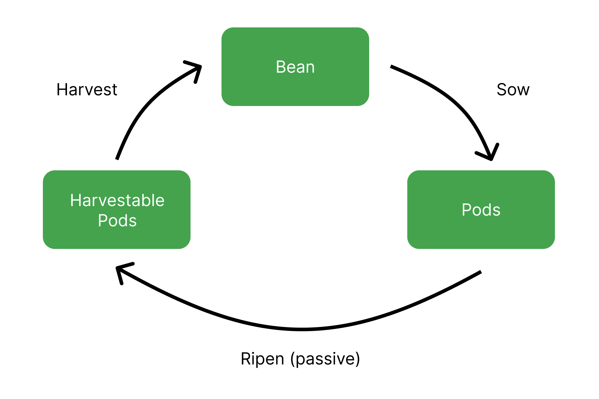

# Field

The Field is Beanstalk's credit facility. Beanstalk relies on a decentralized set of creditors to maintain Bean price stability.

Farmers who Sow (lend) Beans to Beanstalk are known as Sowers.

### **Soil**

Anytime Beanstalk is willing to issue debt, there is Soil in the Field. Soil represents the number of Beans that Beanstalk is currently willing to borrow.

When Beans are Sown, Beanstalk burns them, permanently removing the Sown Beans from the Bean supply. For example, if there’s 10 Soil available and 10 Beans are Sown, the Soil supply becomes 0 and 10 Beans are removed from the Bean supply. If the market is in some sort of equilibrium, Beans are bought to be Sown, which drives the Bean price upward towards its value peg.

Beanstalk [sets the Soil supply](../peg-maintenance/overview.md#soil-supply) at the beginning of each [Season](sun.md) according to the peg maintenance mechanism.

### **Pods**

Beans are Sown in exchange for Pods, the Beanstalk-native debt asset. Loans to Beanstalk are issued with a fixed interest rate, known as Temperature, and an unknown maturity date.

The number of Pods received from 1 Sown Bean is determined by the Temperature at the time of Sowing. Newly issued Pods accumulate in the back of the Pod Line. The front of the Pod Line receives 1/3 of new Bean mints while Sprouts remain Unfertilized (Sprouts are issued by the [Barn](barn.md)). If there are no Unfertilized Sprouts, the front of the Pod Line receives 1/2 of new Bean mints.

Pods Ripen into Harvestable Pods that can be Harvested (redeemed) for 1 Bean each on a First In, First Out (FIFO) basis. There is no penalty for waiting to Harvest Pods.

Pods are tradeable on the [Pod Market](market.md#the-pod-market).

### **Temperature**

The Temperature is the interest rate for Sowing Beans in the Field. At 500% Temperature, 1 Bean can be Sown in exchange for 6 Pods. Once those Pods become Harvestable, they can be Harvested in exchange for 6 Beans.

The Temperature is constant during each Season. Beanstalk [changes the Temperature](../peg-maintenance/temperature.md) at the beginning of each Season depending on various conditions, according to the peg maintenance mechanism.

### **Field Process**

1. Beans are Sown in exchange for Pods.
2. Pods Ripen into Harvestable Pods on a FIFO basis when Beanstalk mints new Beans according to the peg maintenance mechanism.
3. Harvestable Pods can be Harvested into Beans.

### **Economics**

Beanstalk is credit based and only fails if it can no longer attract creditors. A reasonable level of debt, a strong credit history and a competitive interest rate attract creditors.

Beanstalk does not default on debt and is willing to issue Pods every Season.

The combination of non-expiry, the FIFO Harvest schedule and transferability encourages Farmers to Sow Beans as efficiently as possible. By maximizing the efficiency of the Soil market, Beanstalk minimizes its cost to attract creditors, the durations and magnitudes of price deviations below its value peg, and excess Bean minting.
