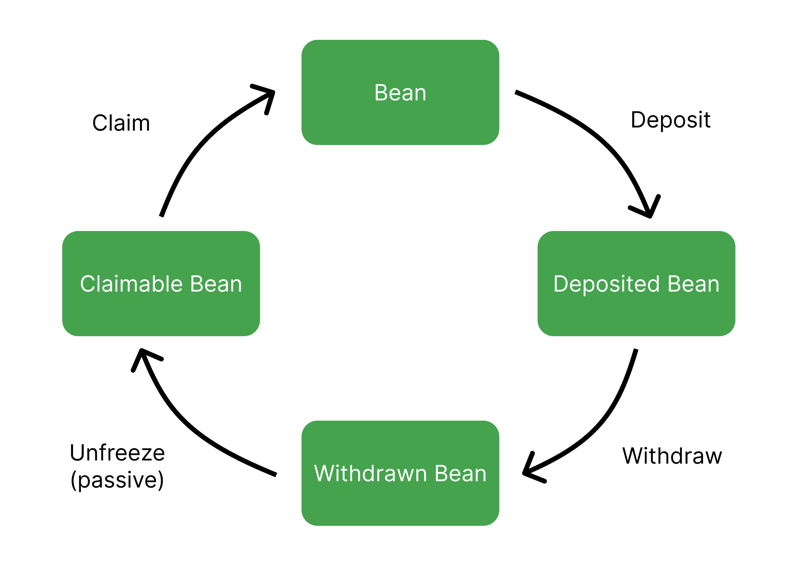

# Silo

The Silo is the Beanstalk DAO. The Silo uses the Stalk System to create protocol-native financial incentives that improve Beanstalk’s security and Bean’s liquidity and stability.

Anyone can become a Silo Member by Depositing whitelisted assets in the Silo to earn Stalk and Seeds. Neither Stalk nor Seeds are liquid.

### **Silo Whitelist**

To be Deposited into the Silo, an ERC-20 standard token must be on the Silo Whitelist. The Whitelist is currently:

* Bean
* BEAN:3CRV LP
* Unripe Bean
* Unripe BEAN:3CRV LP

Additional tokens may be added to the Whitelist via Beanstalk governance. In order for a token to be added to the Whitelist, Beanstalk requires:

1. The token address;
2. A function to calculate the Bean denominated value (BDV) of the token; and
3. The number of Stalk and Seeds per BDV deposited.

### **Current Silo Parameters**

| **Whitelisted asset** | **Stalk per BDV** | **Seeds per BDV** |
| --------------------- | ----------------- | ----------------- |
| Bean                  | 1                 | 2                 |
| BEAN:3CRV LP          | 1                 | 4                 |
| Unripe Bean\*         | 1                 | 2                 |
| Unripe BEAN:3CRV LP\* | 1                 | 4                 |

\*See the [Unripe Assets](barn.md#unripe-assets) section of the [Barn](barn.md) page for more info.

### **The Stalk System**

When whitelisted assets are Deposited into the Silo, Beanstalk rewards the Depositor with Stalk and Seeds. Seeds yield 1/10000 new Stalk every Season.

Stalkholders are entitled to participate in Beanstalk governance and earn a portion of Bean mints. Governance power and distribution of Bean mints are proportional to each Stalkholder’s Stalk balance relative to total outstanding Stalk.

Older Deposits have their Stalk ownership diluted by newer Deposits upon Deposit. Stalk ownership, and each Stalkholder’s share of Beanstalk governance voting power, decentralizes over time. Therefore, newly minted Beans are more widely distributed over time. A design that lowers the Gini coefficient of Beans and Stalk is essential to censorship resistance.

Stalkholders can submit and vote on Beanstalk Improvement Proposals (BIPs). Stalkholders receive 1/3 of new Bean mints while Sprouts remain Unfertilized (Sprouts are issued by the [Barn](barn.md)). If there are no Unfertilized Sprouts, Stalkholders receive 1/2 of new Bean mints.

### **Withdraw**

The associated amount of Stalk, Seeds, and Stalk from Seeds from a given Deposit must be forfeited when the Deposit is Withdrawn from the Silo. The requirement to forfeit Stalk that has grown from Seeds over time creates an opportunity cost to leave the Silo, thereby increasing the stickiness of Deposits the longer they stay Deposited.

Partial Withdrawals are placed on a Last In, First Out (LIFO) basis by the Beanstalk UI, minimizing the amount of Stalk and Seeds forfeited. Deposited assets can be Withdrawn from the Silo at any time but are Frozen for 4 full Seasons after Withdrawal before they can be Claimed.

### **Convert**

When the Bean price is above peg (_i.e._, deltaB is positive), Deposited Beans may be converted to Deposited LP while retaining grown Stalk from Seeds. This conversion allows the Silo Member to sell Beans above peg. In doing so, Beanstalk incentivizes Silo Members to grow liquidity for Beans at the expense of additional Bean mints, as the Bean price is arbitraged back towards peg.

When the Bean price is below peg (_i.e._, deltaB is negative), Deposited LP may be converted to Deposited Beans while retaining grown Stalk from Seeds and without forfeiting any Stalk due to LP impermanent loss. This conversion allows Silo Members to remove excess Beans from liquidity pools and arbitrage the price back towards peg without leaving the Silo, minimizing debt issuance.

Unripe Beans are also convertible to Unripe BEAN:3CRV LP and vice versa in a similar fashion. \*See the [Unripe Assets](barn.md#unripe-assets) section of the [Barn](barn.md) page for more info.

### **Governance**

See [Governance](../governance/beanstalk/) section.

### **Silo Rewards**

**Earned Beans** are Beans that have been paid to a Silo Member since the last Season the Silo Member Planted their Plantable Seeds (defined below). Earned Beans are automatically Deposited into the Silo and do not require any action to claim them.

**Earned Stalk** are Stalk earned from Earned Beans. Earned Stalk automatically contribute to Stalk ownership and do not require any action to claim them.

**Grown Stalk** is the Stalk earned from Seeds. Grown Stalk does not contribute to Stalk ownership until it is Mown. Mow can be called on its own, and it is also called at the beginning of any Silo interaction (Depositing, Withdrawing, Converting, Planting, etc.).

**Revitalized Stalk** is Stalk that have vested for pre-exploit Silo Members as Fertilizer is sold. Revitalized Stalk do not contribute to Stalk ownership until Enrooted. See the [Revitalized Assets](barn.md#revitalized-assets) section of the [Barn](barn.md) page for more info.

**Plantable Seeds** are Seeds earned in conjunction with Earned Beans. Plantable Seeds must be Planted in order to grow Stalk.

**Revitalized Seeds** are Seeds that have vested for pre-exploit Silo Members as Fertilizer is sold. Revitalized Seeds must be Enrooted in order to grow Stalk. See the [Revitalized Assets](barn.md#revitalized-assets) section of the [Barn](barn.md) page for more info.

### **Example**

A Farmer deposits 10,000 Beans in the Silo. The BDV per Bean is 1, so the Deposit receives 10,000 Stalk (1 Stalk per BDV) and 20,000 Seeds (2 Seeds per BDV).

If the Bean supply increases and the Silo Member earns 100 Beans during a Season, the Farmer now has:

* 100 Earned Beans, 100 Earned Stalk, 200 Plantable Seeds, and 2 Grown Stalk (20,000 Seeds \* 1/10000 new Stalk per Season);
* 10,100 Beans in the Silo;
* 20,000 Seeds without calling Plant and 20,200 Seeds if Plant is called; and
* 10,100 Stalk without calling Mow and 10,102 Stalk if Mow is called.
