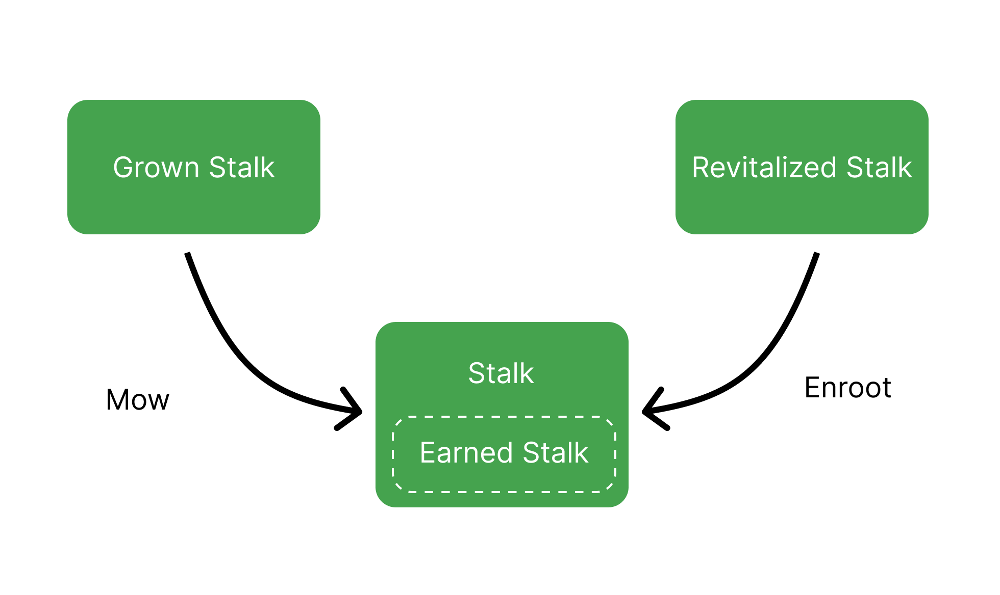
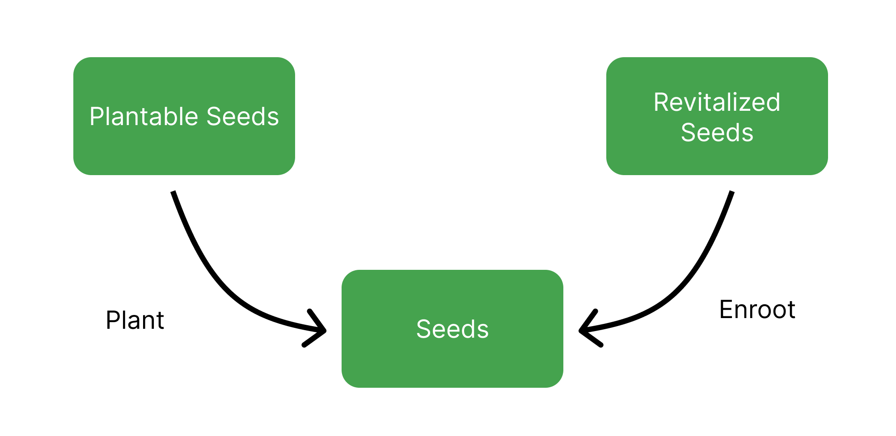

# Silo


Publius explains the Silo



This page has not yet been updated to account for [BIP-45: Seed Gauge System](https://github.com/BeanstalkFarms/Beanstalk/pull/722).


The Silo is the Beanstalk DAO. The Silo uses the Stalk System to create protocol-native financial incentives that improve Beanstalk’s security and Bean’s liquidity and stability.

Anyone can become a Silo Member by Depositing whitelisted assets in the Silo to earn Stalk and Seeds. Neither Stalk nor Seeds are liquid. Deposits are represented as ERC-1155 standard tokens.

For guides on interacting with the Silo through the Beanstalk UI, go [here](../guides/silo/).

### **Deposit Whitelist**

To be Deposited into the Silo, an ERC-20 standard token must be on the Deposit Whitelist.

Additional tokens may be added to the Deposit Whitelist via [Beanstalk governance](broken-reference/). In order for a token to be added to the Deposit Whitelist, Beanstalk requires:

1. The token address;
2. A function to calculate the Bean Denominated Value (BDV) of the token (see [Section 14.2 of the whitepaper](https://bean.money/beanstalk.pdf#subsection.14.2) for complete formulas); and
3. The number of Stalk and Seeds per BDV received upon Deposit.

Deposits are tradeable on [OpenSea](https://opensea.io/collection/silo-deposits).

#### **Current Deposit Whitelist**

| **Whitelisted asset**                                                                           | **Stalk per BDV** | **Seeds per BDV** |
| ----------------------------------------------------------------------------------------------- | ----------------- | ----------------- |
| [Bean](https://etherscan.io/address/0xBEA0000029AD1c77D3d5D23Ba2D8893dB9d1Efab)                 | 1                 | 3                 |
| [BEAN:ETH Well LP](https://etherscan.io/address/0xBEA0e11282e2bB5893bEcE110cF199501e872bAd)     | 1                 | 4.5               |
| [Unripe Bean](https://etherscan.io/address/0x1BEA0050E63e05FBb5D8BA2f10cf5800B6224449)\*        | 1                 | 0                 |
| [Unripe BEAN:ETH LP](https://etherscan.io/address/0x1BEA3CcD22F4EBd3d37d731BA31Eeca95713716D)\* | 1                 | 0                 |

\*See the [Unripe Assets](barn.md#unripe-assets) section of the [Barn](barn.md) page for more info.

### **The Stalk System**

When whitelisted assets are Deposited into the Silo, Beanstalk rewards the Depositor with Stalk and Seeds. Seeds yield 1/10000 new Stalk every [Season](sun.md).

Stalkholders are entitled to participate in Beanstalk governance and earn a portion of Bean mints. Governance power and distribution of Bean mints are proportional to each Stalkholder's Stalk balance relative to total outstanding Stalk.

Older Deposits have their Stalk ownership diluted by newer Deposits upon Deposit. Stalk ownership, and each Stalkholder's share of Beanstalk governance voting power, decentralizes over time. Therefore, newly minted Beans are more widely distributed over time. A design that lowers the Gini coefficient of Beans and Stalk is essential to censorship resistance.

Stalkholders can submit and vote on Beanstalk Improvement Proposals (BIPs). Stalkholders receive 1/3 of new Bean mints while there are more than zero Unfertilized Sprouts (Sprouts are issued by the [Barn](barn.md)). If there are no Unfertilized Sprouts, Stalkholders receive 1/2 of new Bean mints.

### **Withdraw**

The associated amount of Stalk, Seeds, and Stalk from Seeds from a given Deposit must be forfeited when the Deposit is Withdrawn from the Silo. The requirement to forfeit Stalk that has grown from Seeds over time creates an opportunity cost to leave the Silo, thereby increasing the stickiness of Deposits the longer they stay Deposited.

Deposits can be Withdrawn from the Silo at any time. Deposits can be Transferred to another address directly without the loss of Stalk, Seeds, and Stalk from Seeds.

<figure><figcaption></figcaption></figure>

### **Convert**

See [Convert](../peg-maintenance/convert.md) section.

### **Governance**

See [Governance](../governance/beanstalk/) section.

### **Silo Rewards**

**Earned Beans** are Beans that have been paid to a Silo Member since the last Season the Silo Member Planted their Plantable Seeds (defined below). Upon Plant, Earned Beans are Deposited in the current Season.

**Earned Stalk** are Stalk earned from Earned Beans. Earned Stalk automatically contribute to Stalk ownership and do not require any action to claim them.

**Grown Stalk** is the Stalk earned from Seeds. Grown Stalk does not contribute to Stalk ownership until it is Mown. Mow can be called on its own, and it is also called at the beginning of any Silo interaction (Depositing, Withdrawing, Converting, Planting, etc.).

**Revitalized Stalk** are Stalk that have vested for Unripe asset holders. Revitalized Stalk are minted as the BDV of Unripe assets increases. Revitalized Stalk does not contribute to Stalk ownership until Enrooted. See the [Revitalized Assets](barn.md#revitalized-assets) section of the [Barn](barn.md) page for more info.

**Plantable Seeds** are Seeds earned in conjunction with Earned Beans. Plantable Seeds must be Planted in order to grow Stalk.

**Revitalized Seeds** are Seeds that have vested for Unripe asset holders. Revitalized Seeds are minted as the BDV of Unripe assets increases. Revitalized Seeds do not generate Stalk until Enrooted. See the [Revitalized Assets](barn.md#revitalized-assets) section of the [Barn](barn.md) page for more info.

### **Example**

A Farmer deposits 10,000 Beans in the Silo. The BDV per Bean is 1, so the Deposit receives 10,000 Stalk (1 Stalk per BDV) and 20,000 Seeds (2 Seeds per BDV).

If the Bean supply increases and the Silo Member earns 100 Beans during a Season, the Farmer now has:

* 100 Earned Beans, 100 Earned Stalk, 200 Plantable Seeds, and 2 Grown Stalk (20,000 Seeds \* 1/10000 new Stalk per Season);
* 10,100 Beans in the Silo;
* 20,000 Seeds without calling Plant and 20,200 Seeds if Plant is called; and
* 10,100 Stalk without calling Mow and 10,102 Stalk if Mow is called.
