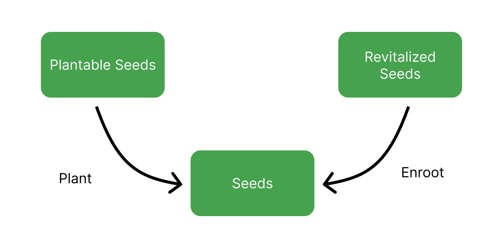

# Silo


Publius explains the Silo


The Silo is the Beanstalk DAO. The Silo uses the Stalk System to create protocol-native financial incentives that improve Beanstalk’s security and Bean’s liquidity and stability.

Anyone can become a Silo Member by Depositing whitelisted assets in the Silo to earn Stalk and Seeds. Neither Stalk nor Seeds are liquid. Deposits are represented as ERC-1155 standard tokens.

For guides on interacting with the Silo through the Beanstalk UI, go [here](../../guides/silo/).

### **Deposit Whitelist**

To be Deposited into the Silo, an ERC-20 standard token must be on the Deposit Whitelist.

Additional tokens may be added to the Deposit Whitelist via [Beanstalk governance](../broken-reference/). In order for a token to be added to the Deposit Whitelist, Beanstalk requires:

1. The token address;
2. A function to calculate the Bean Denominated Value (BDV) of the token; and
3. The number of Stalk issued per BDV;
4. The number of initial Gauge Points (which determine Grown Stalk issuance across various LP tokens);
5. An oracle for calculating the price on the non-Bean asset in the Well;
6. A function to calculate how the Gauge Points change each Season;
7. A function to calculate what portion of liquidity counts towards the [Liquidity to Supply Ratio](../../peg-maintenance/overview.md#liquidity-level) calculation (_i.e._, Liquidity Weight); and
8. The optimal percentage of Deposited LP BDV.

#### **Current Deposit Whitelist**

<table data-header-hidden><thead><tr><th></th><th width="188.33333333333331"></th><th></th><th></th></tr></thead><tbody><tr><td>Whitelisted asset</td><td>Stalk per BDV</td><td>Optimal % Deposited LP BDV</td><td>Liquidity weight</td></tr><tr><td><a href="https://arbiscan.io/address/0xBEA0005B8599265D41256905A9B3073D397812E4">Bean</a></td><td>1</td><td>N/A</td><td>N/A</td></tr><tr><td><a href="https://arbiscan.io/address/0xBeA00Aa8130aCaD047E137ec68693C005f8736Ce">BEAN:WETH Well</a></td><td>1</td><td>16%</td><td>100%</td></tr><tr><td><a href="https://arbiscan.io/address/0xBEa00BbE8b5da39a3F57824a1a13Ec2a8848D74F">BEAN:wstETH Well</a></td><td>1</td><td>26%</td><td>100%</td></tr><tr><td><a href="https://arbiscan.io/address/0xBeA00Cc9F93E9a8aC0DFdfF2D64Ba38eb9C2e48c">BEAN:weETH Well</a></td><td>1</td><td>14%</td><td>100%</td></tr><tr><td><a href="https://arbiscan.io/address/0xBea00DDe4b34ACDcB1a30442bD2B39CA8Be1b09c">BEAN:WBTC Well</a></td><td>1</td><td>20%</td><td>100%</td></tr><tr><td><a href="https://arbiscan.io/address/0xBea00ee04D8289aEd04f92EA122a96dC76A91bd7">BEAN:USDC Well</a></td><td>1</td><td>12%</td><td>100%</td></tr><tr><td><a href="https://arbiscan.io/address/0xbEA00fF437ca7E8354B174339643B4d1814bED33">BEAN:USDT Well</a></td><td>1</td><td>12%</td><td>100%\</td></tr><tr><td><a href="https://arbiscan.io/address/0x1BEA054dddBca12889e07B3E076f511Bf1d27543">Unripe Bean</a>*</td><td>1</td><td>N/A</td><td>N/A</td></tr><tr><td><a href="https://arbiscan.io/address/0x1BEA059c3Ea15F6C10be1c53d70C75fD1266D788">Unripe LP</a>*</td><td>1</td><td>N/A</td><td>N/A</td></tr></tbody></table>

\*See the [Unripe Assets](../barn.md#unripe-assets) section of the [Barn](../barn.md) page for more info.

### **The Stalk System**

When whitelisted assets are Deposited into the Silo, Beanstalk rewards the Depositor with Stalk\* and Seeds. Seeds yield 1/10000 new Stalk every [Season](../sun.md).

Stalkholders are entitled to participate in Beanstalk governance and earn a portion of Bean mints. Governance power and distribution of Bean mints are proportional to each Stalkholder's Stalk balance relative to total outstanding Stalk.

Older Deposits have their Stalk ownership diluted by newer Deposits upon Deposit. Stalk ownership, and each Stalkholder's share of Beanstalk governance voting power, decentralizes over time. Therefore, newly minted Beans are more widely distributed over time. A design that lowers the Gini coefficient of Beans and Stalk is essential to censorship resistance.

Stalkholders can submit and vote on Beanstalk Improvement Proposals (BIPs). Stalkholders receive 1/3 of new Bean mints while there are more than zero Unfertilized Sprouts (Sprouts are issued by the [Barn](../barn.md)). If there are no Unfertilized Sprouts, Stalkholders receive 1/2 of new Bean mints.

#### Germination

\*Stalk is rewarded to a Deposit 2 `gm` calls after Deposit. In the interim, new Deposits are considered Germinating. Germinating Deposits can be Withdrawn or Transferred, but cannot be Converted.

Germination adds flash loan and inter-block MEV manipulation resistance to the calculation of Deposited BDV (used by the Seed Gauge System). By preventing the accrual of Earned Beans for 1 full Season, Beanstalk further disincentivizes inorganic demand.

### The Seed Gauge System

Seeds generate opportunity cost for Withdrawing assets that have been Deposited for longer and marginal benefit for holding particular assets in the Silo in the form of Grown Stalk.

There are 3 new primary tools that Beanstalk has at its disposal as a result of the Seed Gauge System:

1. The Target Seasons to Catch Up, which determines the target number of Seasons for a new Deposit with an average number of Seeds to catch up to the average Grown Stalk per BDV of existing Deposits at the time of Deposit;
2. Bean vs LP Seed distribution, or more specifically, the [Crop Ratio](../../peg-maintenance/crop-ratio.md), which determines the relative benefits of holding Bean exposure vs exposure to at least 1 particular LP token in the Silo over time; and
3. LP vs LP Seed distribution, which determines relative benefits of holding a given non-Bean asset in the Silo over time.

See [Seed Gauge System](seed-gauge-system.md) section for more information.

### **Withdraw**

The associated amount of Stalk, Seeds, and Stalk from Seeds from a given Deposit must be forfeited when the Deposit is Withdrawn from the Silo. The requirement to forfeit Stalk that has grown from Seeds over time creates an opportunity cost to leave the Silo, thereby increasing the stickiness of Deposits the longer they stay Deposited.

Deposits can be Withdrawn from the Silo at any time. Deposits can be Transferred to another address directly without the loss of Stalk, Seeds, and Stalk from Seeds.

<figure><figcaption></figcaption></figure>

### **Convert**

Conversions within the Silo between Bean and LP Deposits serve a major role in peg maintenance. LP Deposits can also be Converted to other LP Deposit types for a potential gain in Stalk and/or Seeds. Conversions from one Deposited asset to another are permissioned by a Convert Whitelist.&#x20;

See [Convert](../../peg-maintenance/convert.md) section for more information.

### **Governance**

See [Governance](../../governance/beanstalk/) section for more information.

### **Silo Rewards**

**Earned Beans** are Beans that have been paid to a Silo Member since the last Season the Silo Member Planted their Plantable Seeds (defined below). Upon Plant, Earned Beans are Deposited in the current Season.

**Earned Stalk** are Stalk earned from Earned Beans. Earned Stalk automatically contribute to Stalk ownership and do not require any action to claim them.

**Grown Stalk** is the Stalk earned from Seeds. Grown Stalk does not contribute to Stalk ownership until it is Mown. Mow can be called on its own, and it is also called at the beginning of any Silo interaction (Depositing, Withdrawing, Converting, Planting, etc.).

**Revitalized Stalk** are Stalk that have vested for Unripe asset holders. Revitalized Stalk are minted as the BDV of Unripe assets increases. Revitalized Stalk does not contribute to Stalk ownership until Enrooted. See the [Revitalized Assets](../barn.md#revitalized-assets) section of the [Barn](../barn.md) page for more info.

**Plantable Seeds** are Seeds earned in conjunction with Earned Beans. Plantable Seeds must be Planted in order to grow Stalk.

**Revitalized Seeds** are Seeds that have vested for Unripe asset holders. Revitalized Seeds are minted as the BDV of Unripe assets increases. Revitalized Seeds do not generate Stalk until Enrooted. See the [Revitalized Assets](../barn.md#revitalized-assets) section of the [Barn](../barn.md) page for more info.

