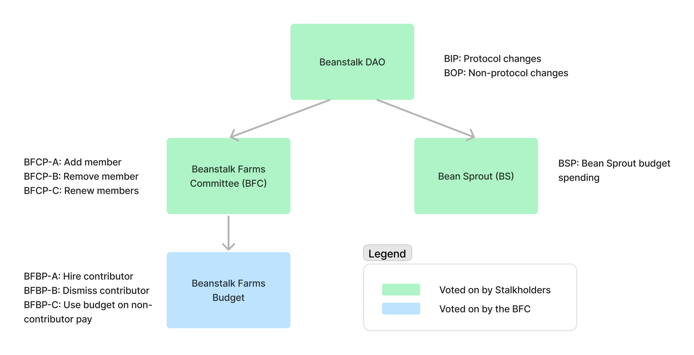

# Proposals

It's important to codify the governance structures for Beanstalk, Beanstalk Farms and Bean Sprout in full and make it such that significantly changing them requires a significant amount of Stalk to vote For.

This page is a comprehensive overview of all proposals type as it pertains to governance of Beanstalk, Beanstalk Farms and Bean Sprout.

#### Notes

* In all cases where Stalkholders vote on a proposal or a proposal requires a minimum Stalk threshold to propose, if the Stalk supply is compromised in a flash loan or other governance attack at the time of proposal, the proposal is void.
* In all cases where a proposal requires a minimum Stalk threshold to propose, the minimum Stalk threshold must be met at the time of proposal.

### BIP

Beanstalk Improvement Proposals, or BIPs, are proposals to change the Beanstalk protocol. Any Stalkholder that owns more than 0.1% of total outstanding Stalk can submit a BIP per the [#proposing-a-bip](beanstalk/bcm-process.md#proposing-a-bip "mention") process. Any Stalkholder can vote For or Abstain. In all instances, 1 Stalk equals 1 vote, and voting Abstain is equivalent to voting against the proposal.

Voting for BIPs takes place on Snapshot, using Stalk ownership at the time of proposal. The Voting Period opens when a BIP is submitted to Snapshot and closes after 7 days or when it is committed with a supermajority.

If at the end of the Voting Period:

* Less than or equal to half of the total outstanding Stalk at the time of proposal on Snapshot votes in favor of the BIP, the BIP fails; or
* More than half of the total outstanding Stalk at the time of proposal on Snapshot votes in favor of the BIP, the BIP passes.

Any time 24 hours or more after the opening and before the closing of the Voting Period that more than two-thirds of the total outstanding Stalk votes in favor of a BIP, the [BCM](beanstalk/bcm-process.md) can execute the BIP on-chain.

Beanstalk governance is designed to move slow and steady. When trying to become an issuer of money, the potential for rapid monetary policy changes is unattractive. By requiring more than 50% of Stalk to vote in favor of a BIP for it to pass, it is quite difficult for a BIP to pass. Therefore, unless the proposed change is _significantly preferred_ by Stalk holders, it is unlikely to pass.

BIPs are proposed on the **Beanstalk DAO Snapshot** page:



### BOP

There is a class of proposals that the DAO should vote on that are not necessarily protocol changes a la BIPs. An example may be, but is not limited to, ratifying the set of disclosures about the risks of interacting with Beanstalk.

Beanstalk Operations Proposals, or BOPs, are proposals for having the Beanstalk DAO vote on things outside of the scopes of other proposals outline on this page.

The following are the processes in place for community members to submit a BOP and coordinate with the [BCM](beanstalk/bcm-dashboard.md) to submit a Snapshot proposal:

1. A proposer must own 0.1% of the total Stalk supply in order to propose a BOP. The proposer shall verify that they meet the Stalk ownership threshold by creating and verifying a signature on etherscan. The steps to create and verify a signature on etherscan can be found [here](https://info.etherscan.com/verify-signature-tool/). The proposer will then reach out to the Mods on Discord and from there, the BCM will verify that the address that signed the message has sufficient Stalk.
2. The proposer will publish the written proposal in a dedicated channel in the Beanstalk Discord. For assistance creating a channel on Discord, contact the Mods on Discord.
3. The written proposal shall be discussed in the Discord channel for a sufficient amount of time. What constitutes sufficient will be at the sole discretion of the BCM, but the BCM must formally propose the BOP on Snapshot on behalf of the proposer within 2 weeks of the creation of the dedicated Discord channel, unless the proposer decides to withdraw their proposal.
4. The BCM will submit a Snapshot of the written proposal to formally begin the voting period.

The voting period for BOPs is 7 days. A BOP requires >35% of the Stalk supply voting For at the end of the voting period in order to pass. Any Stalkholder can vote For or Abstain. In all instances, 1 Stalk equals 1 vote, and voting Abstain is equivalent to voting against the proposal.

BOPs are proposed on the **Beanstalk DAO Snapshot** page:



### BFCP

Beanstalk Farms Committee Proposals, or BFCPs, are proposals related to personnel on the [BFC](beanstalk-farms/#beanstalk-farms-committee). The BFC is the group of Beanstalk Farms contributors that has discretion over the Beanstalk Farms budget, including contributor compensation. Stalkholders vote to add members to the BFC via BFCP-As, remove members from the BFC via BFCP-Bs, and extend the terms of existing BFC members via BFCP-Cs.

Stalkholders vote on BFCPs. All BFCPs have a voting period of 7 days and are proposed on the **Beanstalk Farms Snapshot** page:



**BFCP-A**

BFCP-As are proposals to add someone to the BFC. Anyone with 0.1% of the Stalk supply can propose a BFCP-A. BFCP-As have two voting choices: For and Against, and require 25% of the Stalk supply to reach quorum. Once a quorum is reached, a majority vote For is required to pass.

The term of a BFC member whose BFCP-A passes ends two quarters after the end of the current quarter (end of March, June, September, or December).&#x20;

A BFCP-A is also the proposed BFC member's hiring proposal. Therefore, a BFCP-A must contain salary information at minimum, but should also contain information about what makes the person a good candidate for the BFC, their proposed responsibilities within Beanstalk Farms, etc.

**BFCP-B**

BFCP-Bs are proposals to remove someone from the BFC. Anyone with 0.1% of the Stalk supply can propose a BFCP-B. BFCP-Bs have two voting choices: For and Against, and require 35% of the Stalk supply to reach quorum. Once a quorum is reached, a majority vote For is required to pass.

A BFCP-B is not required if the BFC member voluntarily leaves Beanstalk Farms. The BFC member will create a record of their departure by creating and verifying a signature on etherscan using the address they used to propose and vote on BFBPs.

**BFCP-C**

In the last month of each quarter (March, June, September and December), a BFCP-C is proposed by the BFC. A BFCP-C is the opportunity for the Beanstalk DAO to evaluate each BFC member based on the current quarter **** and extend their term (or not) accordingly. BFCP-Cs are multi-choice votes where each voting choice corresponds to extending the term of a current BFC member.&#x20;

25% of the Stalk supply is required to reach quorum, after which a majority vote For a given BFC member is required to pass (where abstaining on a voting choice is equivalent to voting Against).

BFC members whose renewal proposal passes will have their term extended by two quarters after the end of their current term, with a maximum term length of three quarters after the end of the current quarter. There is no term limit for BFC members.

BFC members have the option to update their previous hiring proposal terms in a BFCP-C.

### BFBP

Beanstalk Farms Budget Proposals, or BFBPs, are proposals related to the use of the Beanstalk Farms budget. Only BFC members can propose and vote on BFBPs. BFBPs have two voting choices: For and Against.

BFC members vote to hire Beanstalk Farms contributors via BFBP-As, dismiss Beanstalk Farms contributors via BFBP-Bs, and otherwise use the Beanstalk Farms budget via BFBP-Cs.

All BFBPs have a voting period of 5 days and are proposed on the **Beanstalk Farms Budget Snapshot** page:



**BFBP-A**

BFBP-As are proposed by a BFC member to hire a contributor to Beanstalk Farms. A BFBP-A passes if at the end of the voting period there are at last 3 votes For, but this can be vetoed by a majority of the BFC voting Against.

Once approved via BFBP-A, a contributor’s term length is indefinite unless otherwise specified (in general, grant work should go through [Bean Sprout](proposals.md#bsp)).

**BFBP-B**

In order to maintain an effective, high quality organization, non-BFC contributors who demonstrate a pattern of underperformance may be dismissed from Beanstalk Farms by the BFC.&#x20;

BFBP-Bs are proposed by a BFC member to dismiss a contributor from Beanstalk Farms. A majority of the BFC (or 3 BFC members, whichever is more) must vote For in order for a BFBP-B to pass.

BFBP-Bs will not mention the contributor’s name, but instead will include a hash, where the input of the hash indicates the contributor being dismissed. The input of the hash will be shared only with the BFC and the contributor in question. This allows the contributor to verify the result of the vote while preserving their privacy during the voting period and if the vote fails.&#x20;

A BFBP-B will still be proposed in circumstances where a contributor is leaving Beanstalk Farms voluntarily, such that the [Beanstalk Farms Budget Snapshot](https://snapshot.org/#/beanstalkfarmsbudget.eth) page can be used as a way to audit how the Beanstalk Farms budget is currently being allocated by the BFC.

**BFBP-C**

BFBP-Cs are proposed by a BFC member to use the Beanstalk Farms budget outside of hiring contributors.

In practice, contributor pay has been and will likely continue to be the majority of Beanstalk Farms expenditures, but there are occasional other payments outside of that scope like paying for upgrades to the subgraph, paying an artist for art on the website, etc.&#x20;

Beanstalk Farms often sends funds to reimburse contributors for various software expenses. A BFBP-C is not required for transactions valued at under 4000 Beans or USDC.

### BSP

Bean Sprout proposals, or BSPs, are proposals to spend the Bean Sprout budget.

Anyone with 0.1% of the Stalk supply or [BSM](bean-sprout/bsm-dashboard.md) signers can propose a BSP. BSPs are voted on by Stalkholders and have two voting choices: For and Against. BSPs are optimistically approved unless a quorum of 10% of the Stalk supply is reached, after which a majority vote Against is required in order to veto. This allows those that are pleased with the actions of Bean Sprout to remain passive, unless there is a quorum voting Against a particular proposal.

A BSP is not required for Bean Sprout to send transactions valued at under 4000 Beans. Bean Sprout hiring proposals can either be proposed as part of a BIP, BOP or BSP.

BSPs are proposed on the **Bean Sprout Snapshot** page:


