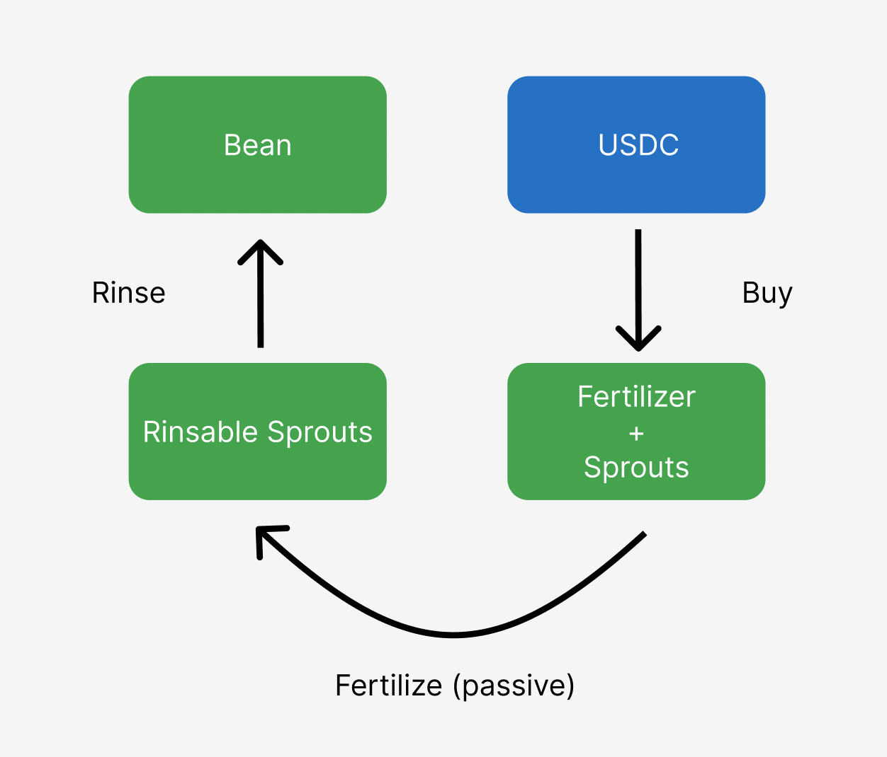

# Understand the Bean Price

Beanstalk uses credit instead of collateral to create Bean price stability relative to its value peg of $1. In practice, this means the protocol incentivizes the regular oscillation of the Bean price above and below its peg. The Bean price will almost never be exactly equal to its peg. Read more about [how Beanstalk works](../../introduction/how-beanstalk-works.md) or an in-depth overview of the [peg maintenance mechanism](../../peg-maintenance/overview.md).

You can view the current Bean price in US dollars at the upper left corner of [app.bean.money](https://app.bean.money/).

.png>)

Selecting the Bean price displays more detail on each of the Bean liquidity pools on the [Deposit Whitelist](../../farm/silo.md#deposit-whitelist).

Currently, the only liquidity pool is BEAN:3CRV LP on Curve. The detail view shows the:

* USD denominated price of Bean in the liquidity pool,
* USD denominated total liquidity in the liquidity pool, including non-Bean assets, and
* deltaB, the shortage or excess of Beans in the liquidity pool. Read more about how deltaB impacts the [Bean supply](../../peg-maintenance/overview.md#bean-supply) and [Soil supply](../../peg-maintenance/overview.md#soil-supply).
