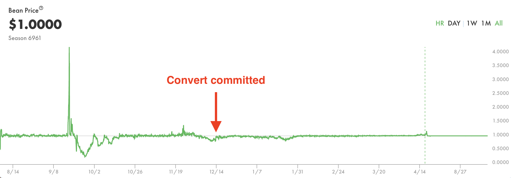

# Convert

Conversions within the [Silo](../farm/silo/) between Bean and LP Deposits serve a major role in peg maintenance.

Conversions from one Deposited asset to another are permissioned by a Convert Whitelist. Conversions can be added or removed from the Convert Whitelist via [Beanstalk governance](broken-reference/).

When the Bean price is above peg (_i.e._, [deltaB](../protocol/glossary.md#deltab) is positive), Deposited Beans may be Converted to Deposited LP tokens while retaining grown Stalk from Seeds. This Conversion allows the Silo Member to add Beans to liquidity pools, which has the practical effect of selling Beans above peg. In doing so, Beanstalk incentivizes Stalkholders to grow liquidity for Beans at the expense of additional Bean mints, as the Bean price is decreased back towards peg.

When the Bean price is below peg (_i.e._, deltaB is negative), Deposited LP tokens may be Converted to Deposited Beans without forfeiting grown Stalk from Seeds or any Stalk due to LP impermanent loss. This Conversion allows Stalkholders to remove excess Beans from liquidity pools and increase the price back towards peg without leaving the Silo, minimizing debt issuance.

Unripe Beans are also convertible to Unripe BEAN:ETH LP, and vice versa, in a similar fashion. See the [Unripe Assets](../farm/barn.md#unripe-assets) section of the [Barn](../farm/barn.md) page for more info.

### Convert Whitelist

In order for a Farmer to be able to Convert a Deposited asset to another, that Conversion must be on the Convert Whitelist.

Additional Conversions may be added to the Convert Whitelist via [Beanstalk governance](../governance/beanstalk/). In order for a Conversion to be added to the Convert Whitelist, Beanstalk requires:

1. The From token address;
2. The To token address;
3. Conditions under which the From token can be converted to the To token; and
4. A function to determine the number of To tokens received for Converting a given number of From tokens (see [Section 14.4 in the whitepaper](https://bean.money/beanstalk.pdf#subsection.14.4) for complete formulas).

#### Current Convert Whitelist

<table><thead><tr><th width="217.33333333333331">From token</th><th width="219">To token</th><th>Conditions</th></tr></thead><tbody><tr><td>Any token on the Deposit Whitelist*</td><td>The same token as From token</td><td>Anytime</td></tr><tr><td>Unripe token</td><td>Underlying token</td><td>Anytime</td></tr><tr><td>Unripe Bean</td><td>Unripe BEAN:wstETH LP</td><td>deltaB in the BEAN:wstETH Well > 0</td></tr><tr><td>Unripe BEAN:wstETH LP</td><td>Unripe Bean</td><td>deltaB in the BEAN:wstETH Well &#x3C; 0</td></tr><tr><td>Bean</td><td>Whitelisted Well LP token</td><td>deltaB in the given Well > 0</td></tr><tr><td>Whitelisted Well LP token</td><td>Bean</td><td>deltaB in the given Well &#x3C; 0</td></tr></tbody></table>

\*Any token on the [Deposit Whitelist](../farm/silo/#deposit-whitelist) can be Converted to the same token in order to allow Stalkholders to update the BDV of their LP tokens when their BDV increases due to impermanent loss.

#### Performance

Convert functionality was first added in [BIP-7](https://github.com/BeanstalkFarms/Beanstalk-Governance-Proposals/blob/master/bip/bip-07-convert.md), and generalized to support a Convert Whitelist in [BIP-21](https://github.com/BeanstalkFarms/Beanstalk-Governance-Proposals/blob/master/bip/bip-21-replant.md). Since BIP-7 was committed, Conversions by Stalkholders have played a significant role in peg maintenance.

<figure><figcaption>
This screenshot of the Bean price chart is from September 12, 2022. See <a href="https://app.bean.money/#/analytics">app.bean.money</a> for the latest data.
</figcaption></figure>

### Generalized Convert

With the introduction of Generalized Convert in [BIP-50](https://bean.money/bip-50), which supports LP token -> LP token Converts as well as Converts against peg (with an associated Stalk penalty). A per-block Convert cap mechanism protects against flash loan attacks.

#### Stalk Penalty

Generalized Convert introduced the ability to Convert against peg and a Stalk penalty for doing so. The penalty applies a 100% reduction in Grown Stalk of the Converted Deposit based on the amount that was Converted against peg.

> For example, if 20 BDV is Converted, and only 10 of the BDV Converted is against peg, then 50% of the Grown Stalk associated with Deposit will be burned. No penalty is applied if the Convert brings the cumulative deltaB closer to 0.

#### Convert Capacity

To prevent flash loan attacks that allow Converting against peg without incurring the Stalk penalty, a Convert capacity mechanism was introduced.

Every Convert updates the amount of BDV Converted per block on a per Well and overall basis. The total capacity available before a penalty applies is based on deltaB for each corresponding Well and the overall deltaB.
