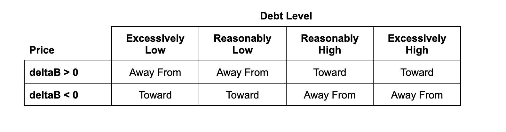
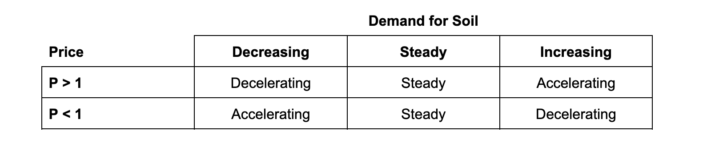
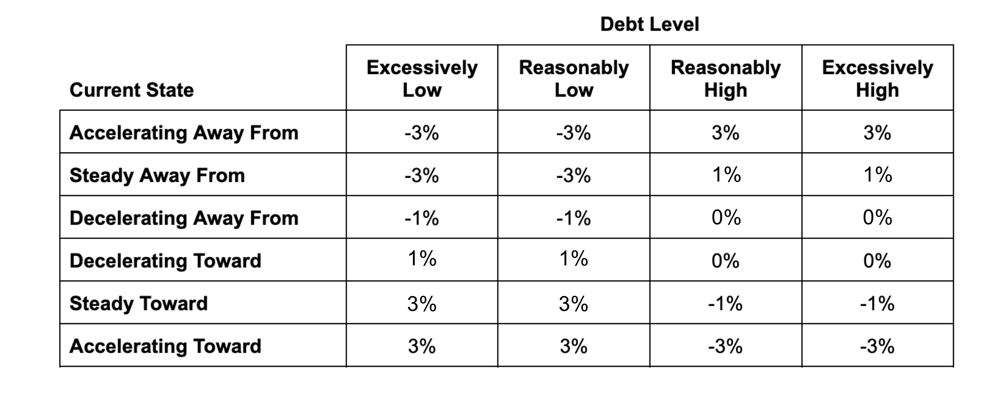

# Temperature

Beanstalk relies on a decentralized set of creditors to maintain Bean price stability. Anytime Beanstalk is willing to issue debt, it issues [Soil](../farm/field.md#soil). Soil represents the number of Beans that Beanstalk is currently willing to borrow. Loans to Beanstalk are issued with a fixed interest rate, known as Temperature. If the Temperature is 500%, 1 Bean can be Sown in exchange for 6 Pods. Once those Pods become Harvestable, they can be Harvested in exchange for 6 Beans.

At the beginning of each [Season](../farm/sun.md), Beanstalk changes the Maximum Temperature depending on its position ([price](overview.md#decentralized-price-oracle) and [debt level](overview.md#debt-level)) and current state ([direction](temperature.md#direction) and [acceleration](temperature.md#acceleration)) with respect to its [ideal equilibrium](overview.md#ideal-equilibrium).

The Temperature increases at the beginning of each block of the [Morning](temperature.md#morning) of each Season (25 blocks) according to a Dutch auction.&#x20;

### **Direction**

The current state of Beanstalk is in part determined by the direction of change with respect to ideal equilibrium.

The direction of change of Beanstalk with respect to ideal equilibrium is considered either toward or away from ideal equilibrium, based on the current debt level and the [deltaB](../protocol/glossary.md#deltab) over the previous Season.

When the deltaB over the previous Season is > 0, debt is paid back. Therefore, if there is more debt than optimal, Beanstalk is moving toward the ideal equilibrium. If there is less debt than optimal, Beanstalk is moving away from the ideal equilibrium.

When the deltaB over the previous Season is < 0, debt can only increase or remain constant. Therefore, if there is more debt than optimal, Beanstalk is moving away from ideal equilibrium. If there is less debt than optimal, Beanstalk is moving toward ideal equilibrium.

### **Demand for Soil**

Demand for Soil is a factor in the acceleration of Beanstalk with respect to ideal equilibrium, which affects Maximum Temperature changes. Demand for Soil is considered decreasing, steady or increasing.

* The number of Sown Beans each Season ($$u_t$$) indicated demand for Soil over the course of that Season.
* The rate of change in the number of Sown Beans each Season (Delta Demand) is calculated as the number of Sown Beans in the previous Season ($$u_{t-1}$$) divided by the number of Sown Beans two Seasons ago ($$u_{t-2}$$).

Based on this ratio of the number of Sown Beans over the prior two Seasons, or Delta Demand:

* If Delta Demand < 95%, demand for Soil is decreasing.
* If 95% ≤ Delta Demand < 105%, demand for Soil is steady.
* If 105% ≤ Delta Demand, demand for Soil is increasing.

However, when there is between 0 and 1 Soil remaining at the end of any Season, the ratio is not used. Instead, Beanstalk checks the following conditions to determine the current demand for Soil:

* After one or more Seasons in which there was > 1 Soil remaining, if there is between 0 and 1 Soil remaining at the end of the latest Season, demand for Soil is increasing.
* When there is at most 1 Soil remaining in consecutive Seasons, the difference in time it takes for the excess Soil (S > 1) to be Sown over the previous two Seasons can provide a more accurate measurement.
  * If S > 1 was Sown in the first 10 minutes of the previous Season, demand for Soil is increasing.
  * If S > 1 was not Sown in the first 10 minutes of the previous Season, Beanstalk compares the time it took for all S > 1 to be Sown in the previous two Seasons ($$u_{t-1}$$ and $$u_{t-2}$$).
  * If it took less than one minute longer for all S > 1 to be Sown in $$u_{t-2}$$ than $$u_{t-1}$$, demand for Soil is decreasing. If it took longer than one minute, demand for Soil is increasing. Otherwise, demand for Soil is steady.

### **Acceleration**

The current state of Beanstalk with respect to ideal equilibrium is in part determined by the acceleration of change.

The acceleration of Beanstalk affects the magnitude of Maximum Temperature changes and is considered decelerating, steady or accelerating based on the price over the previous Season and the demand for Soil.

### **Current and Optimal State**

Based on a combination of Beanstalk’s direction and acceleration, Beanstalk has six potential current states:

* Accelerating away from ideal equilibrium;
* Accelerating toward ideal equilibrium;
* Steady away from ideal equilibrium;
* Steady toward ideal equilibrium;
* Decelerating away from ideal equilibrium; and
* Decelerating toward ideal equilibrium.

Beanstalk’s optimal state is that which moves Beanstalk toward ideal equilibrium in the healthiest fashion, given the current position.

When the debt level is excessively high or low, an optimal state is accelerating toward ideal equilibrium. When the debt level is reasonably high or low, an optimal state is either steady or decelerating toward ideal equilibrium.

Considering the current state and the debt level, Beanstalk adjusts the Maximum Temperature to move toward the optimal state:

<figure><figcaption></figcaption></figure>

The [Maximum Temperature Flow Chart](https://www.figma.com/file/ri6N8czFLXcvuJKWfQtAr8/\[PUBLIC]-Temperature-Flow-Chart?node-id=0%3A1\&t=27N3RhfE52pum1U8-1) contains a graphical representation of each possible state and an explanation for each Maximum Temperature adjustment.

### Morning

During the Morning of each Season (the first 5 minutes), the Temperature increases logarithmically from 1% in the block of a successful `gm` function call up to the Maximum Temperature over the course of 5 minutes (See [Section 8.12.2 of the whitepaper](https://bean.money/beanstalk.pdf#subsubsection.8.12.2) for complete formulas). During times of short-term excess demand for Soil, the Morning results in Beanstalk paying significantly less to attract creditors.
